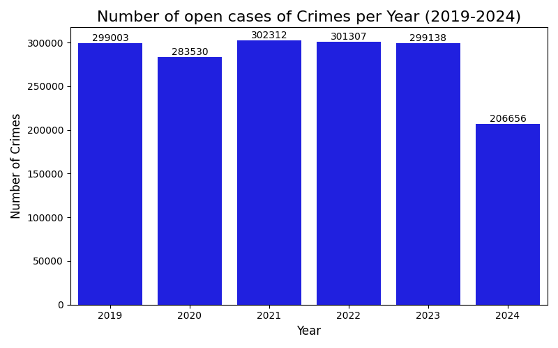
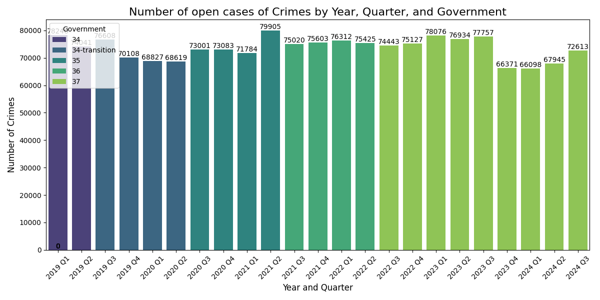
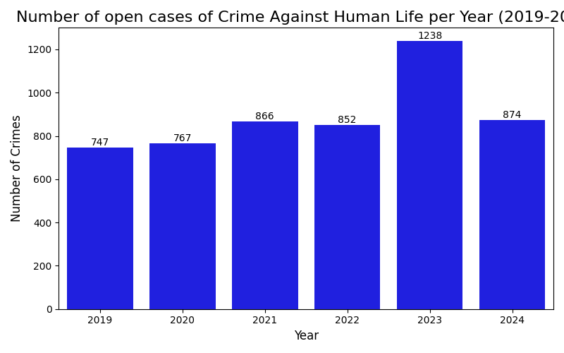
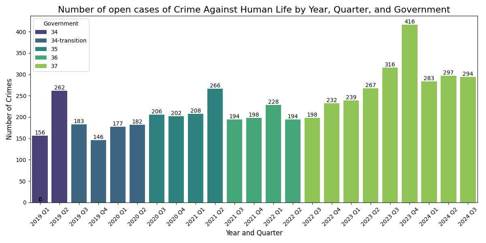
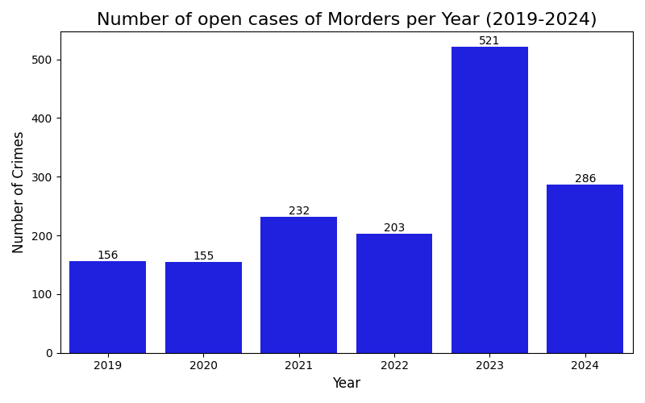
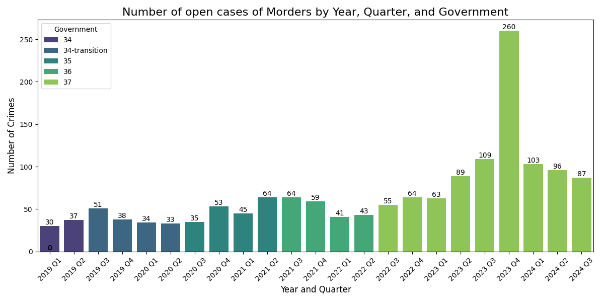
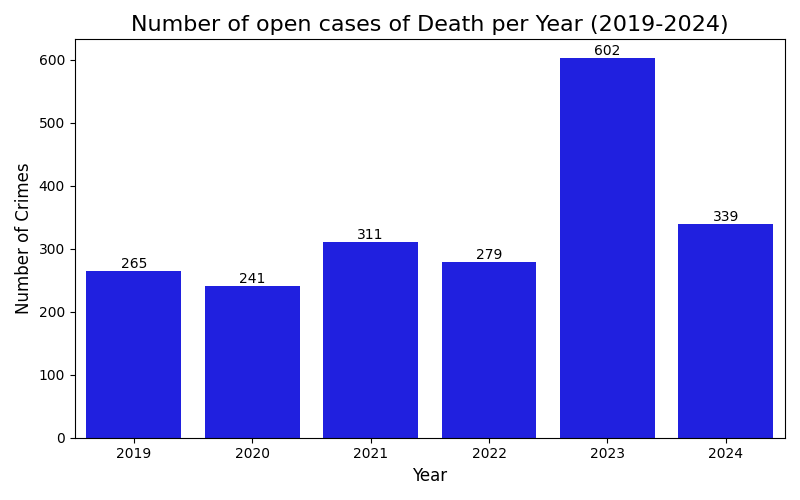
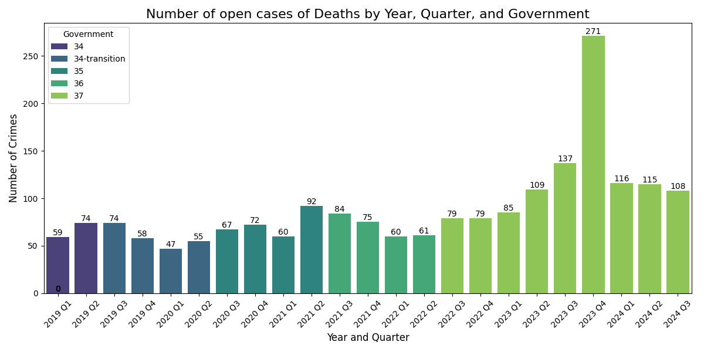
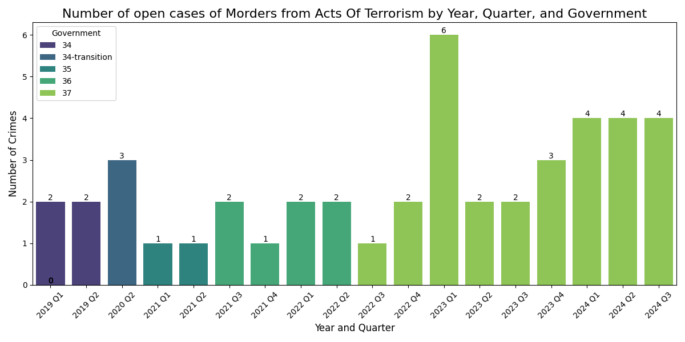

In this file, the five graphs that were analytically examined are presented, where for each examination we will present the annual graph and the quarterly graph

1. **Total crime cases.**

yearly

quarterly

2. **Crimes against human life.**

yearly

quarterly

3. **Murder cases.**

yearly

quarterly

4. **Death cases (including murder, manslaughter, etc.).**

yearly

quarterly

5. **Murders due to terrorism** 

yearly

quarterly

